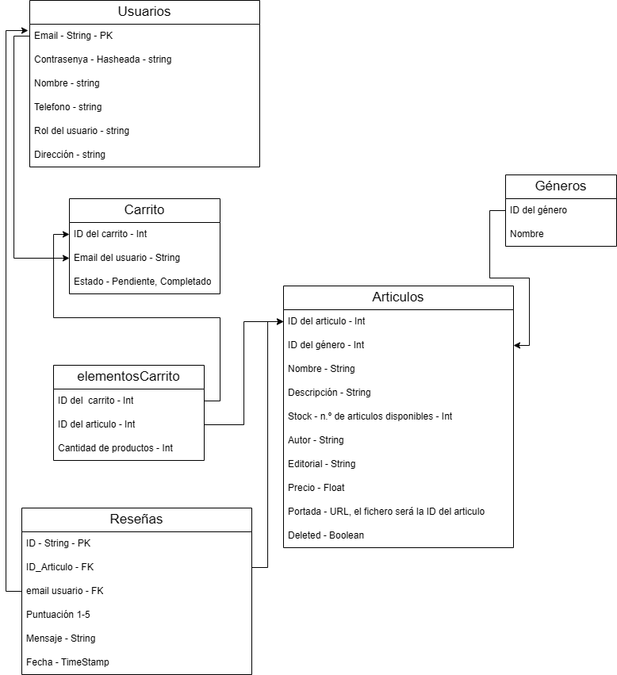

# Base de datos.

* [Usuarios](#usuarios)
* [Articulos](#articulos)
* [Géneros](uso.md)
* [Carrito](bd.md)
* [ElementosCarrito](referencias.md)
* [Reseñas](referencias.md)

Para el completo funcionamiento de está aplicación, se hace uso de una base de datos. Esta base de datos está hecha con MySQL y desde el código se interactua con ella desde las funciones de PHP de Mysqli.

## Diseño de la base de datos

Esta base de datos hace uso de las tablas mostradas anteriormente. Las cuáles son las siguientes

### Usuarios.
Como su nombre indica, esta es la encargada de gestionar a los usuarios. En ella, se almacenan los datos relacionados al usuario, como son:

1. **Email**: Email del usuario, el cuál actua como clave primaria.
2. **Nombre**: Nombre con el que se identifica el usuario.
3. **Contraseña**: Contraseña introducida por el usuario. En la base de datos se recibirá la contraseña hasheada gracias a la función *password_hash*.
4. **Telefono**: El número de contacto del usuario.
5. **Rol**: Representa que tipo de usuario es, pudiendo ser **usuario** o **administrador**
6. **Dirección**: Dirección que da el usuario.

### Articulos
Esta tabla representa los articulos disponibles en la tienda, y por tanto tiene sus datos más comunes, como su nombre, el número de stock, autor o precio entre otros. Encontramos todos estos datos:

1. **ID del Articulo**: ID que representa al articulo en la base de datos, actua como clave primaria.
2. **ID del Género**: ID que representa al género que pertenece el articulo. Es una clave ajena de la tabla **Géneros**
3. **Nombre**: Nombre del articulo que se registra.
4. **Descripción**: Una breve descripción sobre que trata el articulo.
5. **Stock**: Cantidad de productos disponibles.
6. **Autor**: Persona que ha creado el producto a la venta.
7. **Editorial**: Editorial a la que pertenece el producto.
8. **Precio**: Precio al que se vende el producto.
9. **Portada**: Nombre del fichero que contiene la portada del producto. Una vez cargado lo buscará en la carpeta correspondiente ``(public-files/books-imgs)``. En caso de no haber ninguna se llamará a una por defecto.
10. **deleted**: Booleano que indica si el producto está o no eliminado.

### Géneros
Esta tabla se encarga de representar los géneros. En ella simplemente encontramos su ID representativa y el nombre del género. Esta se usa para mostrar en los articulos sus géneros.

### Carrito
Esta tabla representa los carritos de la gente. En ella encontramos lo siguiente:
1. **ID del Carrito**: Representa la ID del carrito 
2. **Email del usuario**: Hace referencia al usuario al que pertenece dicho carrito. Es la clave ajena que referencia a Email en la tabla usuario.
3. **Estado**: Representa el estado del carrito. Este actualmente puede estar en 2 estados:
    - **Pendiente**: El carrito aun no está completo y se siguen agregando productos a este carrito.
    - **Completado**: El carrito ya esta finalizado, se puede ver su contenido desde el apartado de carritos.

### Elementos del Carrito
Esta tabla representa los elementos que un usuario tiene en su carrito. Esta se compone de:
1. **ID del Carrito**: Indica que carrito ha solicitado el producto. Clave ajena de carrito y clave primaria de la tabla
2. **ID del articulo**: Indica que articulo ha agregado al carrito. Clave ajena de articulo y clave primaria de la tabla.
3. **Cantidad de productos**: Número de productos que ha agregado al carrito para comprar.

### Reseñas
Esta tabla contiene los datos de las reseñas de los usuarios. Se compone de:
1. **ID**: ID de la reseña. Es la clave primaria.
2. **ID del Articulo**: Indica en que articulo se hizo la reseña. Clave ajena de articulo.
3. **Email usuario**: Indica que usuario hizo la reseña. Clave ajena de usuario.
4. **Puntuación**: Indica en una escala del 1 al 5 que le ha parecido el libro
5. **Mensaje**: Descripción de que le parecio el articulo.
6. **Fecha**: Momento en el que se creo la reseña.