# Estructura

- [Estructura de datos](#estructuración-de-datos)
- [Estructura de página](#estructura-de-página)
    - [Administración](#administración)
    - [Zona de usuario](#zona-de-usuario)

La aplicacion cuenta con 2 tipos de estructuras, la de datos y la de página.

La estructura de datos se refiere a como se organizan los directorios.
La estructura de página hace referencia a como están organizadas las páginas.

Con esa pequeña explicación, se verá como se organizan cada cosa:

## Estructuración de datos.
Para el correcto funcionamiento de los datos, se han creado distintos directorios donde cada uno cumple una función. La estructura es la siguiente:

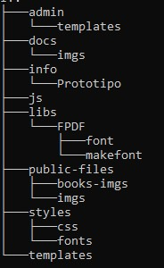

- **admin**: Directorio que contiene todo lo necesario para el funcionamiento de las páginas de administración. Todos los ficheros de está carpeta contarán con una verificación de que se tenga un usuario y de que dicho usuario sea administrador. Cuenta con los siguientes directorios y ficheros:

    - **templates**: Contiene las plantillas  (cabeceras y pies de páginas) exclusivos de administración. Existen dado que las rutas con respecto a las plantillas normales son distintas.
    - **add.php**: fichero que permite agregar nuevos articulos a la base de datos.
    - **addGenre.php**: fichero que permite crear nuevos géneros para los articulos.
    - **editProduct.php**: Fichero que permite la edición de productos.
    - **list.php:** Fichero que lista todos los productos existentes, incluyendo aquellos que se hayán eliminado, permitiendo también exportar todos los articulos **no** eliminados en PDF.
    - **listGenre.php**: Fichero que permite el listado de generos existentes.
    - **productPDF.php**: Fichero encargado de exportar a PDF todos los articulos no eliminados de la base de datos.
    - **removeProduct.php**: Fichero que se encarga de eliminar productos de la base de datos.
    - **userRole.php**: Fichero que permite a los administradores cambiar el rol de los usuarios de administrador a usuario y viceversa.

- **docs**: Directorio en el que se encuentra esta documentación. Dentro están los ficheros MD y las imagenes necesarias.

- **info**: Directorio que contiene distintos documentos, como los prototipos, la guia de estilo, etc.

- **js**: Directorio que contiene los ficheros JavaScript necesarios para el funcionamiento de la aplicación. Principalmente se encuentran 2:

    - **expresiones.js**: Fichero que contiene las expresiones regulares usadas en los formularios.
    - **jquery-4.0.0.min.js**: Librería de JQuery.

- **libs**: Directorio que contiene las librerias. En este directorio se encuentra la carpeta **FPDP**, que es la libería para exportar a PDF desde PHP.

- **public-files**: Directorio de ficheros públicos. Aquí se almacenarán las imagenes de los articulos y las imagenes temporales. Se dividen en 2 directorios:

    - **books-imgs**: Directorio que almacena todas las imagenes de productos.

    - **imgs**: Directorio donde están las imagenes de _placeholder_ en caso de que alguna falle.

- **styles**: Directorio que contiene todos los estilos. Se divide en 2 carpetas:

    - **css**: Almacena todos los ficheros CSS de la aplicación.

    - **fonts**: Directorio que almacena todos los ficheros de fuentes.

- **templates**: Plantillas usadas para la aplicacion. Contiene los ficheros **header.php** y **footer.php**

Finalmente, en la raíz se encuentran los ficheros .php de la aplicación.

## Estructura de página
La página cuenta con su propia estructura, encontrando en primer lugar la página principal

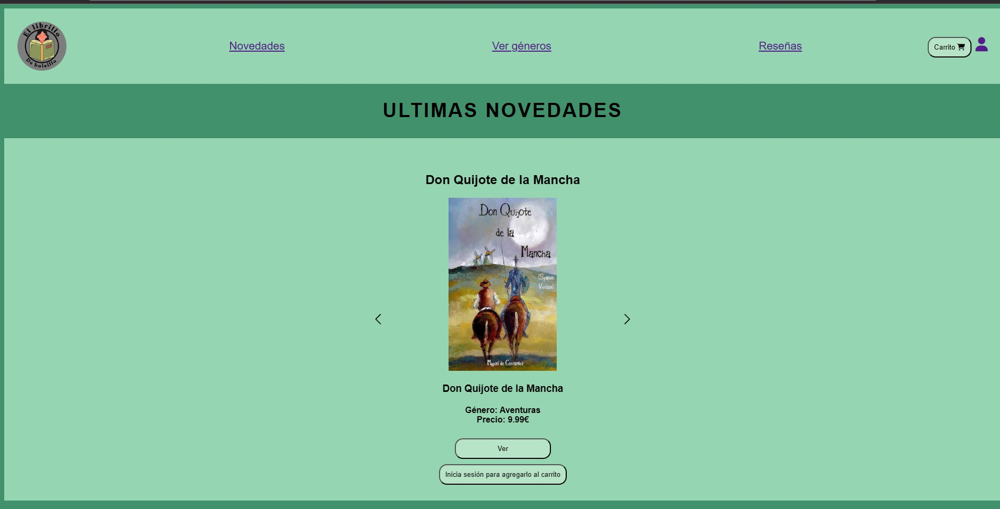

Desde la página principal se puede acceder a todo lo necesario. 
Encontrando:

- **Apartado de novedades**, que muestra todos los productos ordenados

- **Apartado de géneros**, que nos muestra los géneros disponibles y al elegir uno nos muestra los productos de dichos géneros.

- **Apartado de reseña**, nos muestra todas las reseñas hechas de aquellos productos que no se hayan eliminado. En el caso de ser administrador, se da la opción de eliminar las reseñas.

- **Apartado de producto**: Nos muestra la información del producto seleccionado, incluyendo su portada, su nombre, género, precio entre otros. Si se tiene una cuenta se permitirá crear una reseña.

- **Apartado de administracion**, **solo visible para administradores** es la zona que nos permite agregar nuevos productos, modificar los existentes, borrarlos, crear nuevos géneros o agregar nuevos administradores.

- **Carrito**, nos lleva a la página que nos muestra los elementos del carrito. En caso de no tener una cuenta, nos llevará al inicio de sesión.

- **Zona de usuario**, apartado que muestra las opciones que pueden hacer los usuarios. Si no hay una cuenta iniciada, nos manda al inicio de sesión.

- **Inicio de sesión**, zona donde podremos iniciar sesión con nuestras credenciales, correo y contraseña. En caso de no tener cuenta se puede acceder a registro.

- **Registro**, apartado desde el que podremos crear la cuenta, teniendo un apartado que nos muestra los requisitos de la contraseña.

### Administración
Los administradores cuentan con una sección propia, que les permite hacer todas las tareas necesarias.

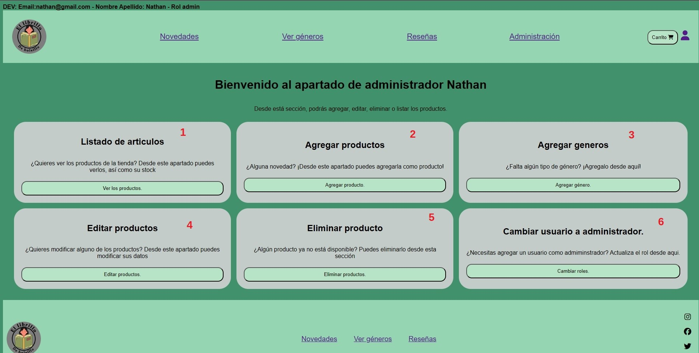

Encontramos 6 paneles donde cada uno tiene su propia funcionalidad:

1. **Listado de articulos**: Se trata de una página que nos muestra el listado de los articulos, disponibles y eliminados, con todos sus datos. Permite exportar una tabla en PDF los articulos disponibles.
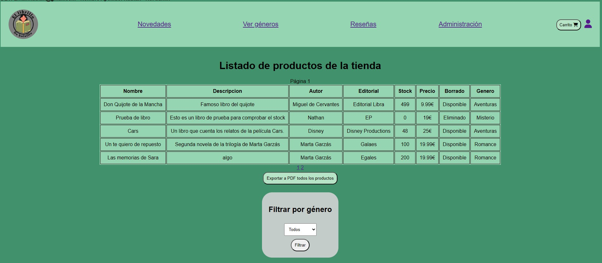
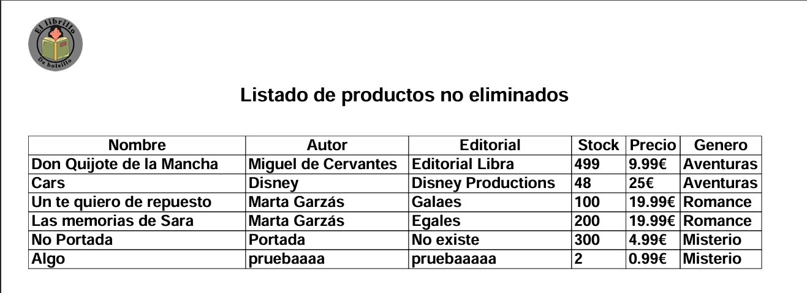

2. **Agregar articulos**: Página que permite a los administradores crear nuevos articulos. Para ello se les muestra un formulario con todo lo necesario para crear el producto.

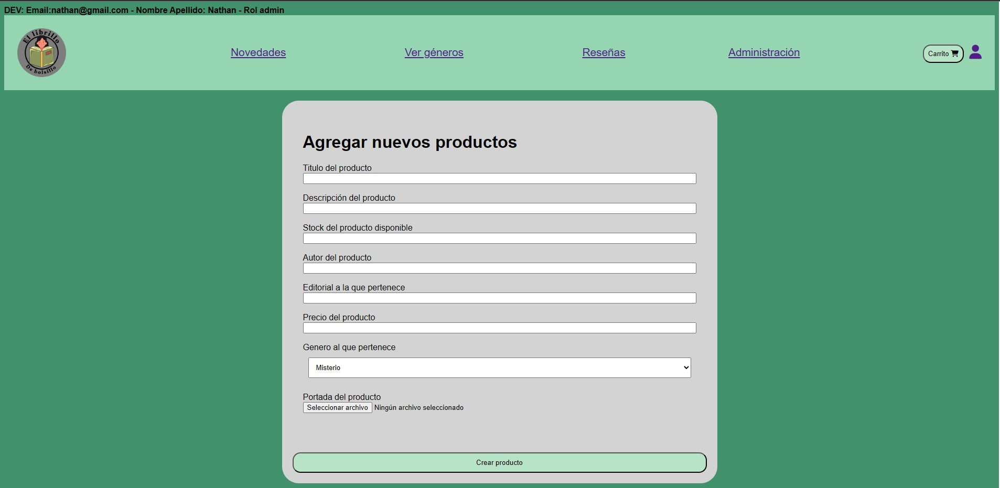

3. **Agregar género**: Página que permite a los administradores crear nuevos géneros para los articulos. Además, incluye un enlace al listado de géneros disponibles.

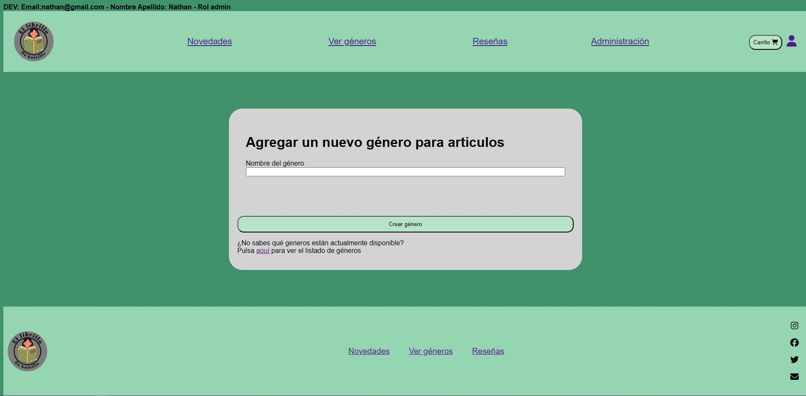
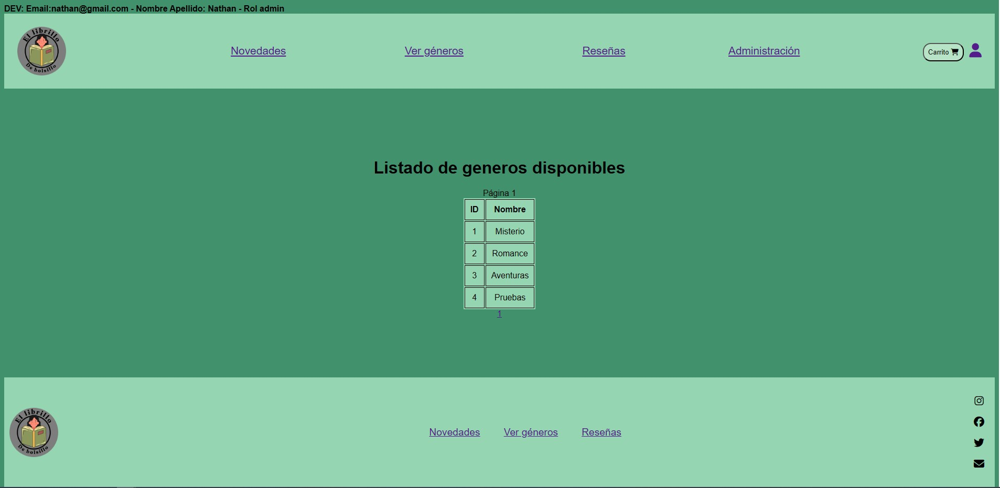

4. **Editar productos**: Página que permite a los administradores editar los articulos, permitiendoles editar cosas como el nombre, su descripción, su stock o el precio.

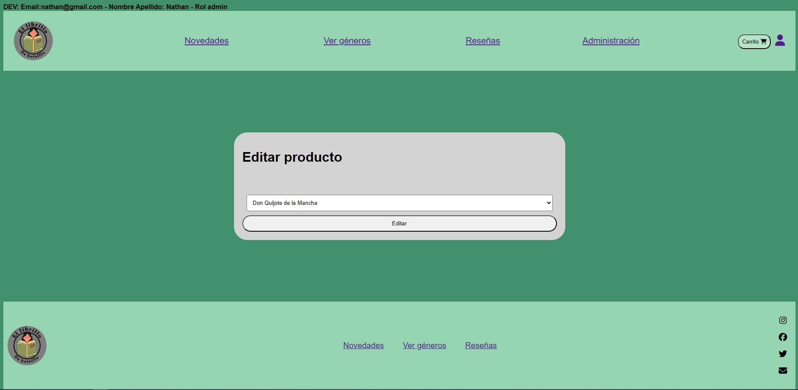
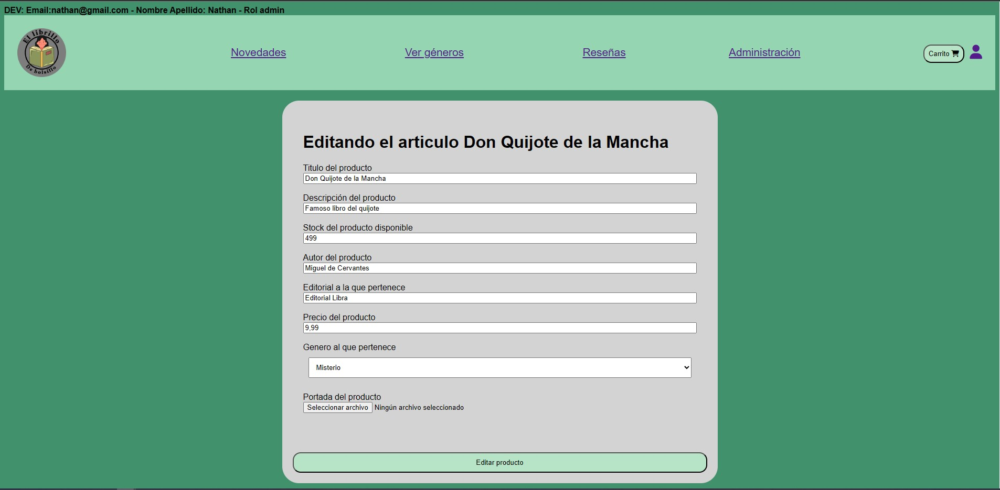

5. **Eliminar productos**: Página que permite a los administradores eliminar los articulos. Dado que para seguir viendo los carritos anteriores se necesita de la existencia de los articulos, estos se actualizan para inidicar que están eliminados, de manera que los elementos de compra los ignoren

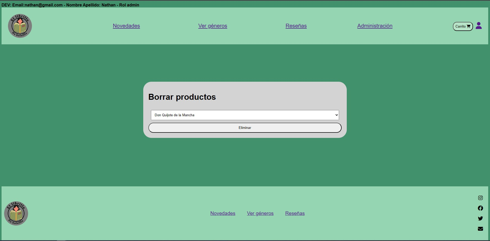

6. **Cambiar usuario a administrador**: Esta página permite a los administradores asignar a los usuarios como administradores, así como quitarles los permisos de administrador.

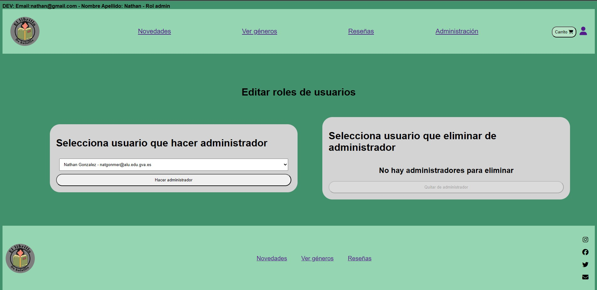

No te puedes borrar a ti mismo de administrador, por lo que siempre habrá minimo un administrador.

### Zona de usuario

Los usuarios cuentan con un apartado propio, desde el que pueden ver sus antiguos carritos, editar su perfil, cerrar sesión o usando la tecnología **AJAX** ver la temperatura de donde se encuentran.

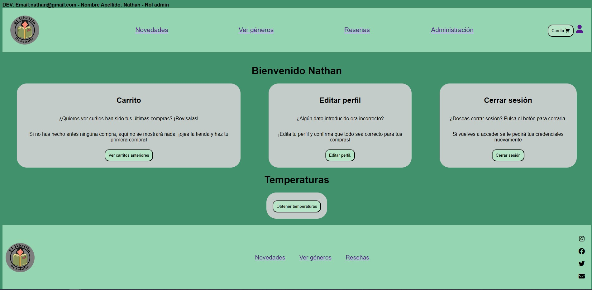

1. **Carrito**: Es una sección que permite ver los carritos anteriores del usuario. Si el carrito esta completado se podrá ver su pedido en PDF

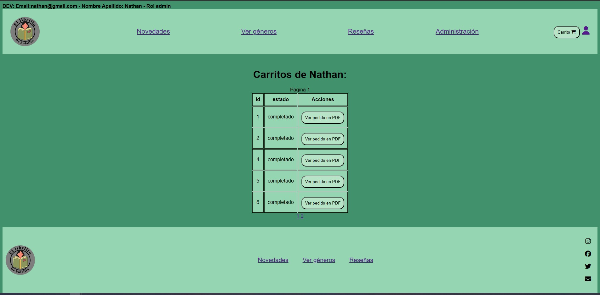
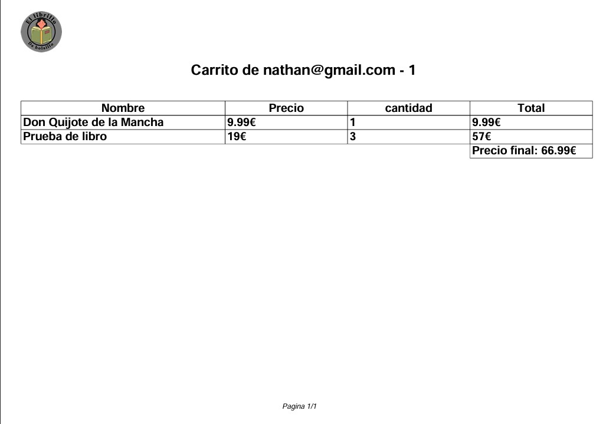

2. **Editar usuario**: Es un apartado que permite modificar la información del usuario, como el nombre, la contraseña o el telefono.

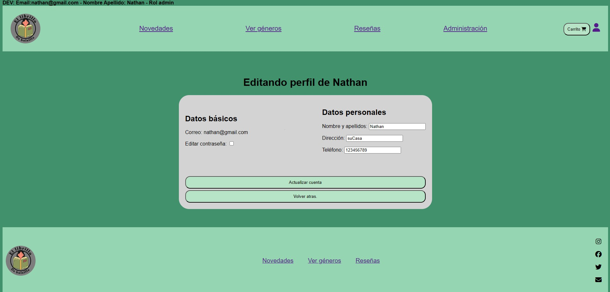
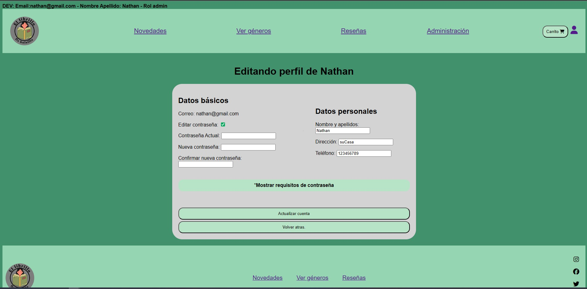

3. **Cerrar sesión**: Simple apartado que cerrará sesión del usuario y le llevará de vuelta a la página principal.

4. **Temperatura**: Apartado que, si se tiene la ubicación activa, muestra la temperatura de donde nos encontremos.

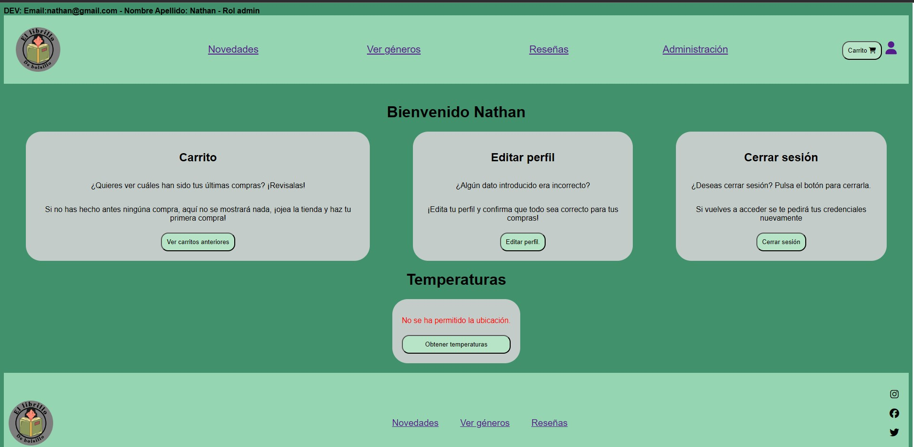
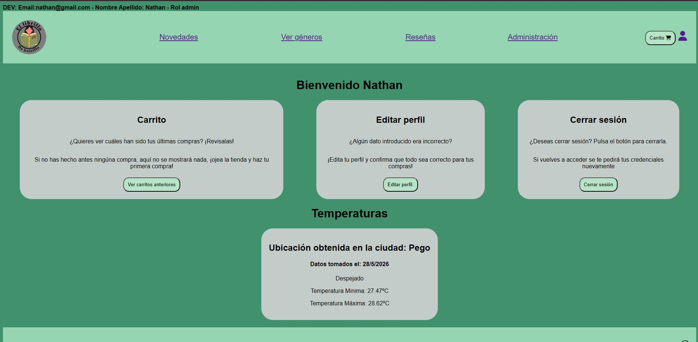