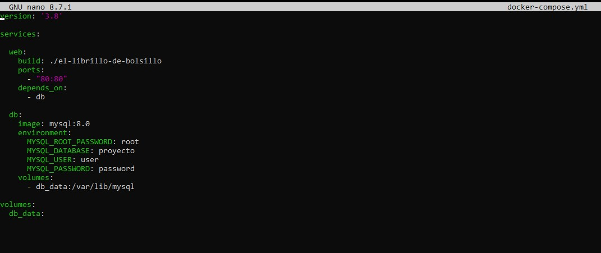

# Instalación
Este apartado mostrará como se debería hacer la instalación de este proyecto.

- [Requisitos](#requisitos)
- [Instalar Nginx en Linux](#como-instalar-el-servidor-de-nginx-en-linux)
- [Configurar base de datos](#configuración-de-la-base-de-datos)


## Requisitos

* PHP 8.0
* MySQL para la gestión de la base de datos
* Servidor web para poder servir la página. Por ejemplo Apache o Nginx.
* Navegador en el que ver la página correctamente.

Para las pruebas en local se puede usar XAMPP, que ya incluye PHP, Apache y MySQL.

### Como instalar el servidor de Nginx en Linux

1. Actualizar repositorios e instalar Nginx:
```
    sudo apt update
    sudo apt install nginx
```
2. Comprobar que se haya instalado
```
    systemctl status nginx
```

3. Una vez instalado, crear la carpeta que tendrá los recursos en el directorio:
```
    /var/www/nombre_web/html
```
4. Crear los fichero de configuración. Estos ficheros se encargaran de decirle que puerto debe usar, donde está el directorio que debe usar, el nombre del sitio, etc. Se encuentran en los siguientes directorios:
```
    /etc/nginx/sites-available/nombre_web || Indica que el sitio esta disponible para ofrecerse
    /etc/nginx/sites-enabled/nombre_web || Indica que el sitio se esta ofreciendo.

Para crearlo en sites-enabled se usa el siguiente comando:

    sudo ln -s/etc/nginx/sites-available/nombre_web /etc/nginx/sites-enabled/
```

5. Reiniciar el servicio de Nginx
```
sudo systemctl restart nginx
```

6. Tras esto, el sitio web debería estar disponible si todo ha ido correctamente.

## Configuración de la Base de datos.
En el repositorio se encuentra un fichero **proyecto.sql** dentro de info, que contiene lo básico para crear la base de datos funcional, incluyendo:

- 2 usuarios, **administrador** y **usuario**
- Sus respectivos carritos.

En el código, se habría que modificar la conexión con la base de datos con nuestros datos. Ahora mismo se encuentra con las siguientes configuraciones:

`Conexión, Usuario, Contraseña, Nombre de Base de datos`

`"localhost", "root", "", "proyecto`

Funcionando con Docker:
`"db", "root", "root", "proyecto", 3306`



Actualmente en el código esta activa la de uso con docker, mientras que la de localhost está comentada.

Para configurarla, hay que modificar donde se llama a la base de datos con los datos que sean necesarios. Para facilitar la modificación de esto, se deja indicado donde se encuentran la declaraciones de la base de datos. Tener en cuenta que actualmente las de localhost están comentadas:

1. **./templates/header.php**: En la declaración de la variable **$databaseConnection** en la linea 35 (localhost) y 36 (Docker)

2. **./admin/templates/header.php**: En la declaración de la variable **$databaseConnection** en la linea 35 (localhost) y 34 (Docker)

3. **./cartPDF.php**: En la declaración de la variable **$databaseConnection** en la linea 114 (localhost) y 115 (Docker).

4. **./admin/productPDF.php**: En la declaración de la variable **$databaseConnection** en la linea 113 (localhost) y 114 (Docker).