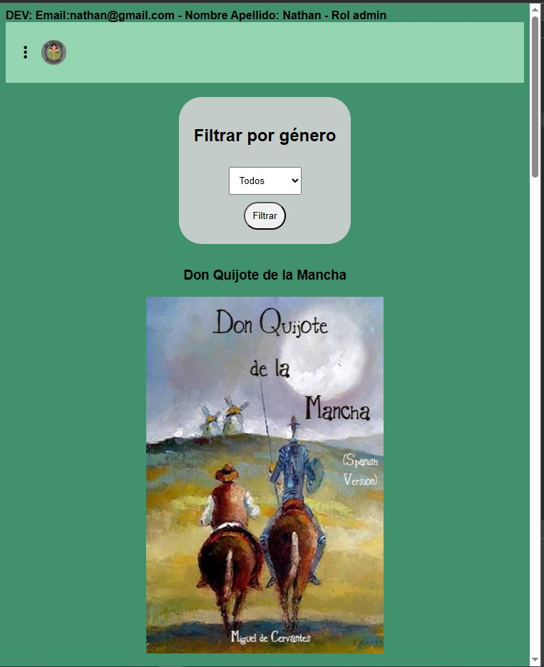
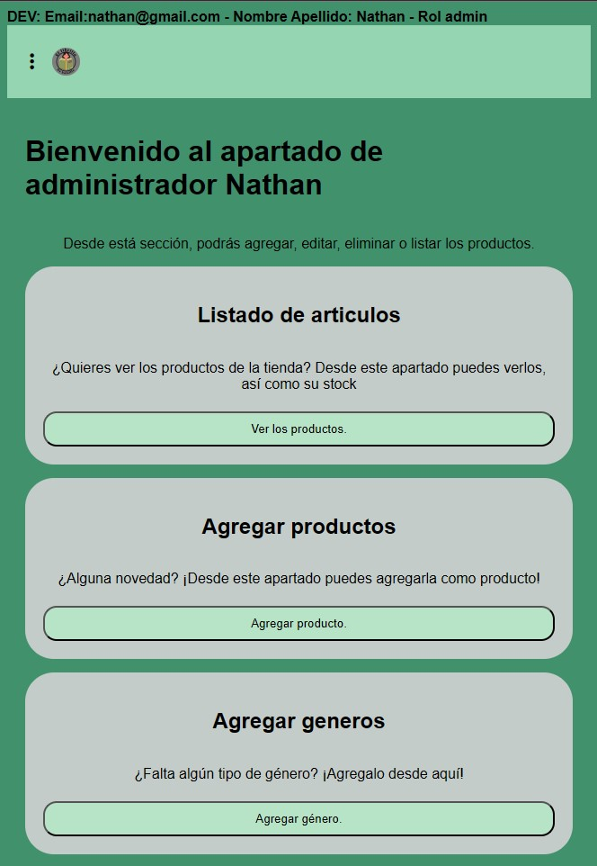
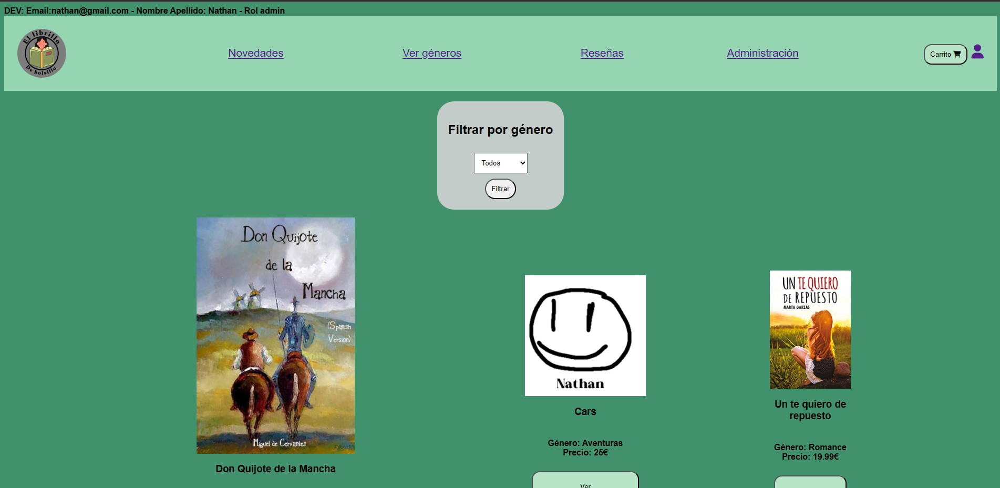
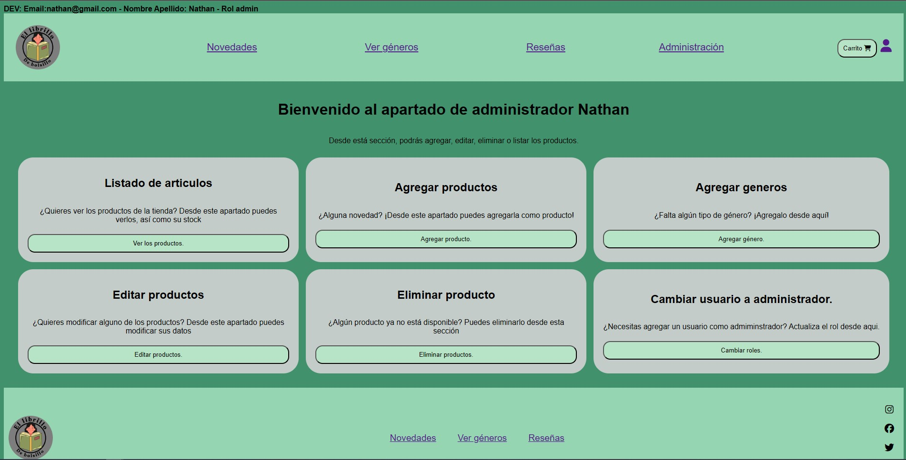

# Imágenes de uso

- [Movil](#movil)
    - [Página principal](#página-principal-movil)
    - [Página de productos](#vista-de-productos-movil)
    - [Vista producto](#vista-de-producto-movil)
    - [Géneros](#géneros-movil)
    - [Administracion](#apartado-de-administrador-movil)

- [Tablet](#tablet)
    - [Página principal](#página-principal-tablet)
    - [Página de productos](#vista-de-productos-tablet)
    - [Vista producto](#vista-de-producto-tablet)
    - [Géneros](#géneros-tablet)
    - [Administracion](#apartado-de-administrador-tablet)

- [Ordenador](#pc)
    - [Página principal](#página-principal-ordenador)
    - [Página de productos](#vista-de-productos-ordenador)
    - [Vista producto](#vista-de-producto-ordenador)
    - [Géneros](#géneros-ordenador)
    - [Administracion](#apartado-de-administrador-ordenador)

## Movil

### Página principal movil

### Vista de productos movil

### Vista de producto movil

### Géneros movil

### Apartado de administrador movil

<!--Separador de apartados. 
Ref: https://stackoverflow.com/questions/44610355/how-to-create-horizontal-line-in-markdown-using-hexo-framework-->
___

## Tablet

### Página principal tablet

### Vista de productos tablet

### Vista de producto tablet

### Géneros tablet

### Apartado de administrador tablet

___

## PC

### Página principal ordenador

### Vista de productos ordenador

### Vista de producto ordenador

### Géneros ordenador

### Apartado de administrador ordenador

